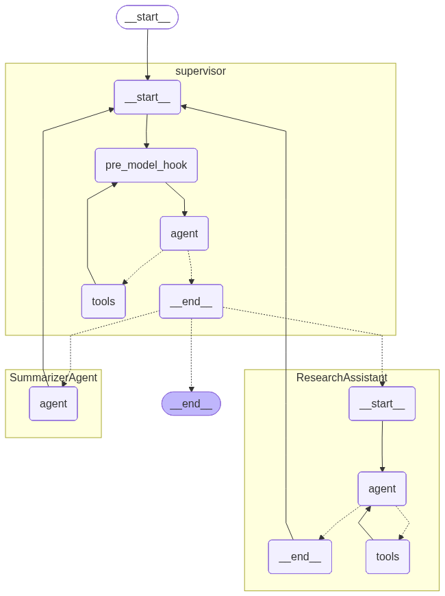

## Clase III: Sistemas cognitivos y agentes autonomos

Esta clase aborda dos componentes principales:

### 1. Multiagente con LangGraph

En la carpeta `Codigo/src/agent/` se encuentra la implementación de un sistema multiagente utilizando [LangGraph](https://langchain-ai.github.io/langgraph/). Este sistema permite la colaboración entre agentes para obtener y leer papers de ArXiv y resumir el contenido, integrando módulos como:

- `agent.py`: Lógica principal de los agentes.
- `prompt.py`: Prompts utilizados por los agentes.
- `state.py`: Manejo de estados de los agentes.

La arquitectura implementada es:

**Ejecución:**  
El archivo principal para probar el sistema es `main.py`.

```shell
python main.py
```

### 2. Workflow n8n

El archivo `n8n_rss.json` se encuentra en la carpeta `n8n` contiene un workflow para [n8n](https://n8n.io/), una herramienta de automatización de flujos de trabajo. Este workflow está diseñado para procesar fuentes RSS y puede integrarse con un sistema de agente para automatizar tareas de recuperación y procesamiento de información, etc. En este caso es para interactuar por medio de chat con el contenido extraido.

**Uso:**  
Importa el archivo `n8n_rss.json` en tu instancia de n8n para desplegar el workflow.

---

**Referencias:**
- [LangGraph Documentation](https://langchain-ai.github.io/langgraph/)
- [n8n Documentation](https://docs.n8n.io/)
